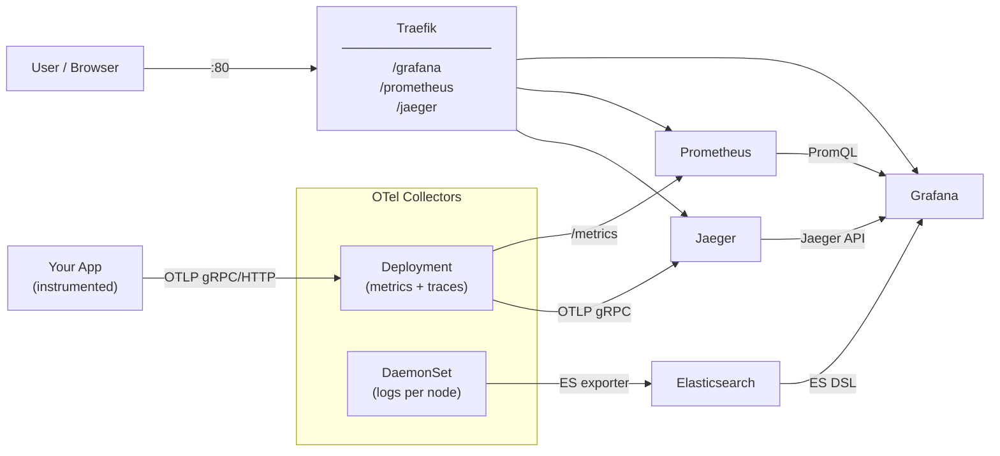
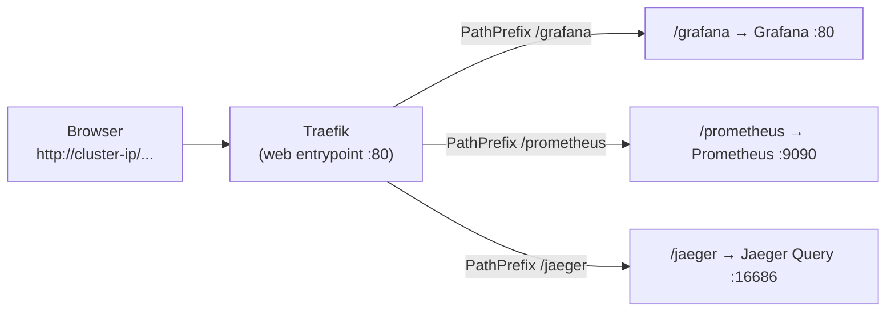
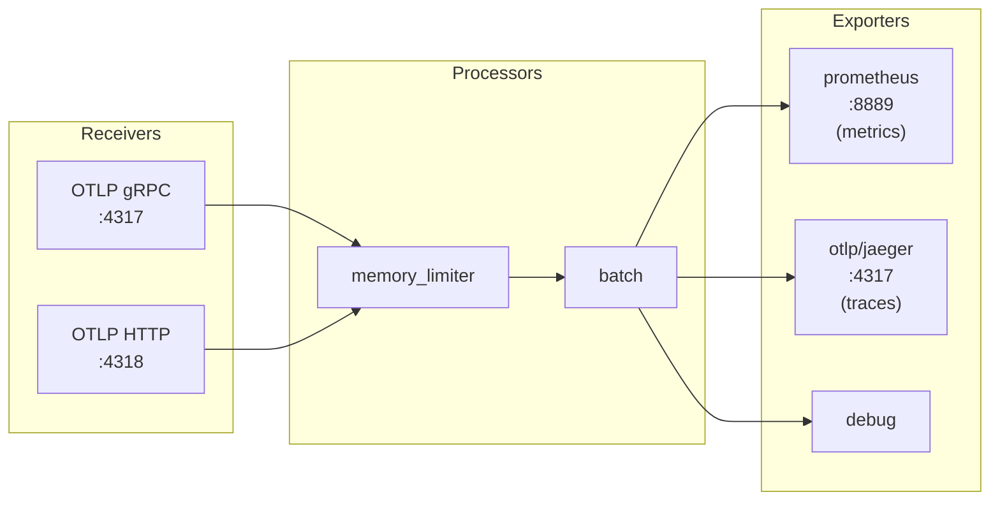
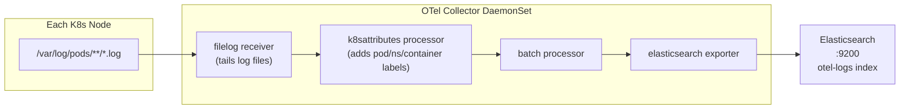
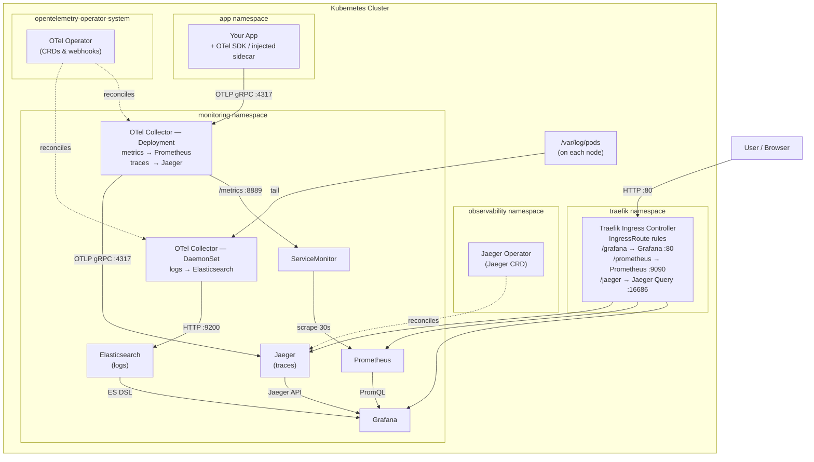
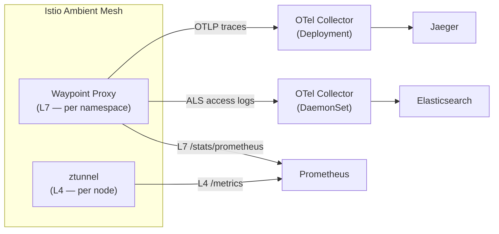

---
tags:
  - opentelemetry
  - kubernetes
  - observability
  - prometheus
  - elasticsearch
  - jaeger
  - grafana
  - traefik
  - otel
created: 2026-06-03
---

# OpenTelemetry on Kubernetes — Full Observability Stack Setup

## Overview

This tutorial sets up the **three pillars of observability** on Kubernetes using OpenTelemetry as the unified collection layer, all exposed through a single **Traefik** ingress on path-based routing.

| Pillar | Tool | Industry role |
|---|---|---|
| **Metrics** | Prometheus + Grafana | De facto standard for K8s metrics |
| **Logs** | Elasticsearch | Industry-standard log store and search engine |
| **Traces** | Jaeger | CNCF graduated distributed tracing platform |



**Components:**
| Component | Pillar | Role |
|---|---|---|
| **Traefik** | — | Path-based routing — single entry point for all UIs |
| **OTel Operator** | — | Manages Collector CRDs and admission webhooks |
| **OTel Collector (Deployment)** | Metrics + Traces | Receives OTLP from apps; fans out metrics to Prometheus, traces to Jaeger |
| **OTel Collector (DaemonSet)** | Logs | Tails pod log files per node, ships to Elasticsearch |
| **Prometheus** | Metrics | Scrapes and stores metrics |
| **Elasticsearch** | Logs | Stores, indexes, and full-text searches log data |
| **Jaeger** | Traces | Stores distributed traces; provides trace search and dependency graphs |
| **Grafana** | All | Unified dashboards — correlate traces ↔ logs ↔ metrics |

**Ingress URL map:**

| Path | Service | Port |
|---|---|---|
| `/grafana` | Grafana | 80 |
| `/prometheus` | Prometheus | 9090 |
| `/jaeger` | Jaeger Query UI | 16686 |

---

## Prerequisites

- Kubernetes cluster (v1.24+) — local: `kind`, `minikube`, or `k3d`
- `kubectl` configured and pointing at your cluster
- `helm` v3 installed

> [!tip] Local cluster notes
> **k3d / k3s** — Traefik is the **default ingress controller**. Skip Step 3 entirely and check it's already running:
> ```bash
> kubectl get pods -n kube-system | grep traefik
> ```
>
> **kind** — ports aren't exposed by default. Create your cluster with host port mappings so Traefik can bind to port 80:
> ```yaml
> # kind-config.yaml
> kind: Cluster
> apiVersion: kind.x-k8s.io/v1alpha4
> nodes:
>   - role: control-plane
>     extraPortMappings:
>       - containerPort: 80
>         hostPort: 80
>         protocol: TCP
>       - containerPort: 443
>         hostPort: 443
>         protocol: TCP
> ```
> ```bash
> kind create cluster --config kind-config.yaml
> ```

---

## Step 1 — Install cert-manager

> [!info] What is cert-manager and why does OTel need it?
> **cert-manager** automates TLS certificate creation, renewal, and rotation inside the cluster.
>
> The OTel Operator registers **Admission Webhooks** to validate configs and inject auto-instrumentation sidecars. Kubernetes **hard-requires HTTPS** for all webhook endpoints. cert-manager builds a private in-cluster PKI chain (self-signed CA → webhook TLS cert) and its `cainjector` patches the `caBundle` field in the webhook config so the API server trusts it.
>
> ```mermaid
> sequenceDiagram
>     participant Dev as kubectl
>     participant API as K8s API Server
>     participant Wh as OTel Operator Webhook
>     participant CM as cert-manager
>
>     CM-->>Wh: issues TLS cert (stored in Secret)
>     Dev->>API: kubectl apply -f otel-collector.yaml
>     API->>Wh: ValidatingWebhook call (HTTPS required)
>     Wh-->>API: ✅ config is valid
>     API-->>Dev: resource created
> ```

```bash
# Pinned to a known-good release — check for a newer one before bumping:
# https://github.com/cert-manager/cert-manager/releases
kubectl apply -f https://github.com/cert-manager/cert-manager/releases/download/v1.20.2/cert-manager.yaml

kubectl wait --for=condition=Ready pods --all -n cert-manager --timeout=120s
```

Verify:

```bash
kubectl get pods -n cert-manager
# cert-manager-xxxx            1/1   Running
# cert-manager-cainjector-xxxx 1/1   Running
# cert-manager-webhook-xxxx    1/1   Running
```

---

## Step 2 — Install the OpenTelemetry Operator

```bash
helm repo add open-telemetry https://open-telemetry.github.io/opentelemetry-helm-charts
helm repo update

helm install opentelemetry-operator open-telemetry/opentelemetry-operator \
  --namespace opentelemetry-operator-system \
  --create-namespace \
  --set "manager.collectorImage.repository=otel/opentelemetry-collector-contrib"
```

Verify:

```bash
kubectl get pods -n opentelemetry-operator-system
# opentelemetry-operator-xxxx   2/2   Running
```

---

## Step 3 — Install Traefik

Traefik is a cloud-native ingress controller and reverse proxy purpose-built for Kubernetes. It auto-discovers services via its native `IngressRoute` CRD and includes a built-in dashboard.

> [!note] Already on k3d or k3s?
> Traefik ships pre-installed. Skip this step and jump to Step 4.

```bash
helm repo add traefik https://traefik.github.io/charts
helm repo update

helm install traefik traefik/traefik \
  --namespace traefik \
  --create-namespace \
  --set ports.web.exposedPort=80 \
  --set ports.websecure.exposedPort=443
```

Wait for the controller to be ready:

```bash
kubectl wait --namespace traefik \
  --for=condition=Ready pod \
  --selector=app.kubernetes.io/name=traefik \
  --timeout=120s
```

Get the external IP (use this as your `<CLUSTER-IP>` throughout this tutorial):

```bash
kubectl get svc -n traefik traefik
# NAME      TYPE           EXTERNAL-IP
# traefik   LoadBalancer   <CLUSTER-IP>
```

> On local clusters, `EXTERNAL-IP` is `localhost` or `127.0.0.1`.
> On `minikube`, run `minikube tunnel` in a separate terminal to assign an IP.

### Optional — expose the Traefik dashboard

The Traefik dashboard gives a live view of discovered routes, middlewares, and service health. Expose it via an `IngressRoute`:

```yaml
# traefik-dashboard.yaml
apiVersion: traefik.io/v1alpha1
kind: IngressRoute
metadata:
  name: traefik-dashboard
  namespace: traefik
spec:
  entryPoints:
    - web
  routes:
    - match: PathPrefix(`/traefik`)
      kind: Rule
      middlewares:
        - name: traefik-strip-prefix
      services:
        - name: api@internal
          kind: TraefikService
---
apiVersion: traefik.io/v1alpha1
kind: Middleware
metadata:
  name: traefik-strip-prefix
  namespace: traefik
spec:
  stripPrefix:
    prefixes:
      - /traefik
```

```bash
kubectl apply -f traefik-dashboard.yaml
# Dashboard → http://<CLUSTER-IP>/traefik/dashboard/
```

---

## Step 4 — Install the Observability Backends

All backends go into the `monitoring` namespace. Each is configured with its sub-path so it works correctly behind the Ingress.

```bash
helm repo add prometheus-community https://prometheus-community.github.io/helm-charts
helm repo add elastic https://helm.elastic.co
helm repo update
```

### Prometheus + Grafana

Grafana is configured with `serve_from_sub_path=true` so all redirects and asset URLs are relative to `/grafana`. Prometheus is told its external URL so internal links are correct.

```bash
helm install kube-prometheus-stack prometheus-community/kube-prometheus-stack \
  --namespace monitoring \
  --create-namespace \
  --set prometheus.prometheusSpec.serviceMonitorSelectorNilUsesHelmValues=false \
  --set prometheus.prometheusSpec.podMonitorSelectorNilUsesHelmValues=false \
  --set prometheus.prometheusSpec.externalUrl="http://<CLUSTER-IP>/prometheus" \
  --set prometheus.prometheusSpec.routePrefix="/prometheus" \
  --set "grafana.grafana\.ini.server.serve_from_sub_path=true" \
  --set "grafana.grafana\.ini.server.root_url=http://<CLUSTER-IP>/grafana"
```

### Elasticsearch (log store)

> [!note] Chart status
> `elastic/elasticsearch` is in maintenance mode — Elastic now recommends the **ECK operator** for new deployments. It still works fine for a dev/tutorial stack; for production prefer [ECK](https://www.elastic.co/guide/en/cloud-on-k8s/current/index.html).

Multi-line `esConfig` doesn't survive `--set` escaping reliably (embedded `<br/>` ends up literal), so use a values file:

```yaml
# es-values.yaml
replicas: 1
minimumMasterNodes: 1
esConfig:
  elasticsearch.yml: |
    xpack.security.enabled: false
    xpack.security.transport.ssl.enabled: false
resources:
  requests:
    cpu: 500m
    memory: 1Gi
  limits:
    memory: 2Gi
```

```bash
helm install elasticsearch elastic/elasticsearch \
  --namespace monitoring \
  -f es-values.yaml
```

> [!warning] Production note
> Keep security enabled in production and supply credentials to the OTel Collector exporter:
> ```yaml
> exporters:
>   elasticsearch:
>     endpoints: [https://elasticsearch-master:9200]
>     user: elastic
>     password: <secret>
> ```

### Jaeger (trace store)

Jaeger is managed by the **Jaeger Operator**, which reconciles a `Jaeger` CRD into the underlying Deployment and Services. It reuses the cert-manager webhooks from Step 1, and its CRD mirrors the OTel Operator pattern.

> [!note] Why the operator (not the Helm chart)?
> The current `jaegertracing/jaeger` Helm chart ships **Jaeger v2**, whose config model differs significantly (single `jaeger` Service, full config override). The Jaeger Operator (v1.65.0) manages **Jaeger v1** and creates predictable `jaeger-collector` / `jaeger-query` Services — the targets used in Steps 5 and 6. Don't mix the two approaches.

Install the operator (cluster-scoped; watches all namespaces):

```bash
kubectl create namespace observability
kubectl apply -n observability \
  -f https://github.com/jaegertracing/jaeger-operator/releases/download/v1.65.0/jaeger-operator.yaml

kubectl wait --for=condition=Available deployment/jaeger-operator \
  -n observability --timeout=120s
```

Create an all-in-one instance. `query.base-path: /jaeger` serves the UI under the `/jaeger` prefix; OTLP receivers (`:4317`/`:4318`) are enabled by default.

```yaml
# jaeger.yaml
apiVersion: jaegertracing.io/v1
kind: Jaeger
metadata:
  name: jaeger
  namespace: monitoring
spec:
  strategy: allInOne
  allInOne:
    options:
      query:
        base-path: /jaeger
  storage:
    type: memory
    options:
      memory:
        max-traces: 100000
```

```bash
kubectl apply -f jaeger.yaml
```

The operator creates `jaeger-collector` (OTLP on `:4317`/`:4318`) and `jaeger-query` (UI on `:16686`) Services in `monitoring` — referenced by the IngressRoute (Step 5) and the metrics/traces Collector (Step 6).

> [!warning] Production note
> In-memory storage is lost on pod restart. For production, switch to the `production` strategy backed by Elasticsearch (see Step 12):
> ```yaml
> spec:
>   strategy: production
>   storage:
>     type: elasticsearch
>     options:
>       es:
>         server-urls: http://elasticsearch-master.monitoring.svc.cluster.local:9200
>   query:
>     options:
>       query:
>         base-path: /jaeger
> ```

Verify all backends are running:

```bash
kubectl get pods -n monitoring
# prometheus-kube-prometheus-stack-prometheus-0   2/2   Running
# kube-prometheus-stack-grafana-xxxx              3/3   Running
# elasticsearch-master-0                          1/1   Running
# jaeger-xxxx                                     1/1   Running
```

---

## Step 5 — Create the IngressRoute

Traefik uses its own `IngressRoute` CRD instead of the standard Kubernetes `Ingress` object. Routes are matched using Traefik's rule syntax (`PathPrefix`, `Host`, etc.), and no URL rewriting is needed because each backend is already configured to serve from its own sub-path.



```yaml
# observability-ingressroute.yaml
apiVersion: traefik.io/v1alpha1
kind: IngressRoute
metadata:
  name: observability-ingressroute
  namespace: monitoring
spec:
  entryPoints:
    - web           # binds to port 80; use "websecure" for TLS on 443
  routes:
    - match: PathPrefix(`/grafana`)
      kind: Rule
      services:
        - name: kube-prometheus-stack-grafana
          port: 80
    - match: PathPrefix(`/prometheus`)
      kind: Rule
      services:
        - name: kube-prometheus-stack-prometheus
          port: 9090
    - match: PathPrefix(`/jaeger`)
      kind: Rule
      services:
        - name: jaeger-query
          port: 16686
```

```bash
kubectl apply -f observability-ingressroute.yaml

# Confirm Traefik picked up the routes
kubectl get ingressroute -n monitoring
# NAME                        AGE
# observability-ingressroute  10s
```

All UIs are now accessible:
- Grafana → `http://<CLUSTER-IP>/grafana`
- Prometheus → `http://<CLUSTER-IP>/prometheus`
- Jaeger → `http://<CLUSTER-IP>/jaeger`
- Traefik dashboard → `http://<CLUSTER-IP>/traefik/dashboard/` *(if configured)*

---

## Step 6 — Deploy the Metrics + Traces Collector (Deployment)

This Collector receives OTLP from apps and fans out metrics to Prometheus and traces to Jaeger.



```yaml
# otel-collector.yaml
apiVersion: opentelemetry.io/v1alpha1
kind: OpenTelemetryCollector
metadata:
  name: otel-collector
  namespace: monitoring
spec:
  mode: deployment
  config: |
    receivers:
      otlp:
        protocols:
          grpc:
            endpoint: 0.0.0.0:4317
          http:
            endpoint: 0.0.0.0:4318

    processors:
      batch:
        timeout: 10s
      memory_limiter:
        limit_mib: 400
        spike_limit_mib: 100
        check_interval: 5s

    exporters:
      prometheus:
        endpoint: "0.0.0.0:8889"
      otlp/jaeger:
        endpoint: jaeger-collector.monitoring.svc.cluster.local:4317
        tls:
          insecure: true
      debug:
        verbosity: basic

    service:
      pipelines:
        metrics:
          receivers: [otlp]
          processors: [memory_limiter, batch]
          exporters: [prometheus, debug]
        traces:
          receivers: [otlp]
          processors: [memory_limiter, batch]
          exporters: [otlp/jaeger, debug]
```

```bash
kubectl apply -f otel-collector.yaml
kubectl get pods -n monitoring -l app.kubernetes.io/component=opentelemetry-collector
```

---

## Step 7 — Deploy the Log Collector (DaemonSet)

A **DaemonSet** Collector runs one pod per node to tail `/var/log/pods`, enrich log lines with Kubernetes metadata, and ship to Elasticsearch.



### RBAC

```yaml
# otel-log-collector-rbac.yaml
apiVersion: v1
kind: ServiceAccount
metadata:
  name: otel-log-collector
  namespace: monitoring
---
apiVersion: rbac.authorization.k8s.io/v1
kind: ClusterRole
metadata:
  name: otel-log-collector
rules:
  - apiGroups: [""]
    resources: ["pods", "namespaces", "nodes"]
    verbs: ["get", "list", "watch"]
---
apiVersion: rbac.authorization.k8s.io/v1
kind: ClusterRoleBinding
metadata:
  name: otel-log-collector
roleRef:
  apiGroup: rbac.authorization.k8s.io
  kind: ClusterRole
  name: otel-log-collector
subjects:
  - kind: ServiceAccount
    name: otel-log-collector
    namespace: monitoring
```

```bash
kubectl apply -f otel-log-collector-rbac.yaml
```

### DaemonSet Collector

```yaml
# otel-log-collector.yaml
apiVersion: opentelemetry.io/v1alpha1
kind: OpenTelemetryCollector
metadata:
  name: otel-log-collector
  namespace: monitoring
spec:
  mode: daemonset
  serviceAccount: otel-log-collector
  volumeMounts:
    - name: varlogpods
      mountPath: /var/log/pods
      readOnly: true
  volumes:
    - name: varlogpods
      hostPath:
        path: /var/log/pods
  config: |
    receivers:
      filelog:
        include:
          - /var/log/pods/*/*/*.log
        start_at: beginning
        include_file_path: true
        include_file_name: false
        operators:
          # The built-in container operator auto-detects docker / CRI-O /
          # containerd formats and promotes k8s.pod.name, k8s.namespace.name,
          # and k8s.container.name to RESOURCE attributes (parsed from the log
          # file path) — which is exactly what k8sattributes associates on below.
          - type: container
            id: container-parser

    processors:
      batch:
        timeout: 5s
      k8sattributes:
        auth_type: serviceAccount
        passthrough: false
        extract:
          metadata:
            - k8s.namespace.name
            - k8s.pod.name
            - k8s.pod.uid
            - k8s.container.name
            - k8s.node.name
        pod_association:
          - sources:
              - from: resource_attribute
                name: k8s.pod.name
              - from: resource_attribute
                name: k8s.namespace.name

    exporters:
      elasticsearch:
        endpoints: [http://elasticsearch-master.monitoring.svc.cluster.local:9200]
        logs_index: otel-logs
        tls:
          insecure: true

    service:
      pipelines:
        logs:
          receivers: [filelog]
          processors: [k8sattributes, batch]
          exporters: [elasticsearch]
```

```bash
kubectl apply -f otel-log-collector.yaml
kubectl get pods -n monitoring -l app.kubernetes.io/name=otel-log-collector-collector
# One pod per node — e.g. otel-log-collector-xxxx   1/1   Running  (x3 for 3-node cluster)
```

---

## Step 8 — Expose Metrics Collector to Prometheus (ServiceMonitor)

```yaml
# otel-service-monitor.yaml
apiVersion: monitoring.coreos.com/v1
kind: ServiceMonitor
metadata:
  name: otel-collector
  namespace: monitoring
  labels:
    release: kube-prometheus-stack
spec:
  selector:
    matchLabels:
      app.kubernetes.io/name: otel-collector-collector
  endpoints:
    - port: prometheus
      path: /metrics
      interval: 30s
  namespaceSelector:
    matchNames:
      - monitoring
```

```bash
kubectl apply -f otel-service-monitor.yaml
```

> **Tip:** Confirm the port name if the ServiceMonitor doesn't work:
> ```bash
> kubectl get svc otel-collector-collector -n monitoring -o jsonpath='{.spec.ports[*].name}'
> ```

---

## Step 9 — Instrument Your Application

### Option A — Auto-instrumentation (zero-code change)

```yaml
# instrumentation.yaml
apiVersion: opentelemetry.io/v1alpha1
kind: Instrumentation
metadata:
  name: my-instrumentation
  namespace: default
spec:
  exporter:
    endpoint: http://otel-collector-collector.monitoring.svc.cluster.local:4318
  propagators:
    - tracecontext
    - baggage
  sampler:
    type: parentbased_traceidratio
    argument: "1"
  python:
    image: ghcr.io/open-telemetry/opentelemetry-operator/autoinstrumentation-python:latest
  java:
    image: ghcr.io/open-telemetry/opentelemetry-operator/autoinstrumentation-java:latest
  nodejs:
    image: ghcr.io/open-telemetry/opentelemetry-operator/autoinstrumentation-nodejs:latest
```

```bash
kubectl apply -f instrumentation.yaml
```

> [!tip] Pin the auto-instrumentation images
> `...autoinstrumentation-*:latest` floats and can drift out of sync with the operator. Pin each to a released tag (e.g. `:0.50.0`) that matches your OTel Operator version for reproducible injections.

Annotate your Deployment:

```yaml
annotations:
  instrumentation.opentelemetry.io/inject-python: "true"
```

### Option B — Manual SDK (Python example)

```python
from opentelemetry import trace
from opentelemetry.sdk.trace import TracerProvider
from opentelemetry.exporter.otlp.proto.grpc.trace_exporter import OTLPSpanExporter
from opentelemetry.sdk.trace.export import BatchSpanProcessor

provider = TracerProvider()
provider.add_span_processor(
    BatchSpanProcessor(OTLPSpanExporter(endpoint="http://otel-collector:4317"))
)
trace.set_tracer_provider(provider)
```

Set via env vars (preferred):

```yaml
env:
  - name: OTEL_EXPORTER_OTLP_ENDPOINT
    value: "http://otel-collector-collector.monitoring.svc.cluster.local:4317"
  - name: OTEL_SERVICE_NAME
    value: "my-service"
```

---

## Step 10 — Verify All Three Pillars

### Metrics — Prometheus

Open `http://<CLUSTER-IP>/prometheus` → **Status → Targets** → `otel-collector` should show `UP`.

```promql
otelcol_receiver_accepted_metric_points_total
```

### Logs — Elasticsearch

Elasticsearch stays cluster-internal (no Ingress path), so port-forward it first:

```bash
kubectl port-forward -n monitoring svc/elasticsearch-master 9200:9200 &

# Check the otel-logs index exists
curl http://localhost:9200/_cat/indices/otel-logs*

# Sample a document — expect k8s.* fields
curl http://localhost:9200/otel-logs/_search?size=1 | jq '.hits.hits[0]._source'
```

### Traces — Jaeger

Open `http://<CLUSTER-IP>/jaeger`:
- **Service** dropdown lists your instrumented services
- Select a service → **Find Traces** → inspect spans and timing

---

## Step 11 — Grafana: Data Sources and Dashboards

Open `http://<CLUSTER-IP>/grafana`

Default credentials:
- **Username:** `admin`
- **Password:**
  ```bash
  kubectl get secret kube-prometheus-stack-grafana -n monitoring \
    -o jsonpath="{.data.admin-password}" | base64 --decode
  ```

### Add Elasticsearch data source

1. **Connections → Data Sources → Add new → Elasticsearch**
2. URL: `http://elasticsearch-master.monitoring.svc.cluster.local:9200`
3. Index name: `otel-logs`
4. Time field: `@timestamp`
5. **Save & Test**

### Add Jaeger data source

1. **Connections → Data Sources → Add new → Jaeger**
2. URL: `http://jaeger-query.monitoring.svc.cluster.local:16686`
3. **Save & Test**

### Wire up Trace ↔ Log correlation

In the **Jaeger data source settings**, scroll to **Trace to logs**:

| Field | Value |
|---|---|
| Data source | Elasticsearch |
| Filter by trace ID | Enable — maps `traceId` field in ES logs |
| Tags | `k8s.pod.name`, `k8s.namespace.name` |

Click a span in Explore → Grafana jumps to that pod's Elasticsearch logs for the same time window.

> [!note] Trace-ID correlation needs app cooperation
> Filtering logs *by trace ID* only works if your application writes the `traceId` into its log lines (e.g. an OTel logging bridge or structured logging with trace context). The DaemonSet ships raw stdout — without trace IDs in the log text, correlation falls back to pod + time-window matching only.

### Import dashboards

| Dashboard | ID | Data source |
|---|---|---|
| OTel Collector | **15983** | Prometheus |
| Elasticsearch Logs | **14191** | Elasticsearch |
| Jaeger Traces | **14370** | Jaeger |

---

## Step 12 — (Optional) Persistent Storage for Jaeger and Prometheus

### Jaeger → Elasticsearch backend

Switch the `Jaeger` CR from `allInOne`/`memory` to the `production` strategy. The operator redeploys separate collector and query Deployments backed by Elasticsearch:

```yaml
# jaeger.yaml
apiVersion: jaegertracing.io/v1
kind: Jaeger
metadata:
  name: jaeger
  namespace: monitoring
spec:
  strategy: production
  storage:
    type: elasticsearch
    options:
      es:
        server-urls: http://elasticsearch-master.monitoring.svc.cluster.local:9200
        index-prefix: jaeger
  query:
    options:
      query:
        base-path: /jaeger
```

```bash
kubectl apply -f jaeger.yaml
```

### Prometheus persistent volume

```bash
helm upgrade kube-prometheus-stack prometheus-community/kube-prometheus-stack \
  --namespace monitoring \
  --reuse-values \
  --set prometheus.prometheusSpec.storageSpec.volumeClaimTemplate.spec.storageClassName=standard \
  --set prometheus.prometheusSpec.storageSpec.volumeClaimTemplate.spec.resources.requests.storage=20Gi
```

---

## Troubleshooting

| Symptom | Likely Cause | Fix |
|---|---|---|
| `http://<IP>/grafana` returns 404 | IngressRoute not picked up by Traefik | `kubectl describe ingressroute -n monitoring`; check Traefik pod logs |
| Traefik doesn't see the IngressRoute | Traefik not watching `monitoring` namespace | Confirm Traefik RBAC allows cross-namespace watch; check `helm get values traefik -n traefik` |
| Grafana loads but CSS/JS broken | `serve_from_sub_path` not set | Re-run Helm upgrade with `serve_from_sub_path=true` and correct `root_url` |
| Jaeger UI loads but redirects to `/` | `base-path` not set in CR | Check `spec.allInOne.options.query.base-path: /jaeger` in your `Jaeger` CR; `kubectl describe jaeger jaeger -n monitoring` |
| Jaeger pods not created | Operator not watching `monitoring` namespace | `kubectl logs -n observability deploy/jaeger-operator`; confirm no namespace restriction in operator args |
| Prometheus UI shows wrong base path | `routePrefix` not set | Re-run with `routePrefix=/prometheus` and `externalUrl` set |
| Collector pod `CrashLoopBackOff` | Bad config YAML | `kubectl logs <pod> -n monitoring` |
| Prometheus target `DOWN` | ServiceMonitor label mismatch | Check `release:` label matches Helm release name |
| No logs in Elasticsearch | DaemonSet can't reach ES | Check collector logs; verify ES pod is running |
| Logs missing K8s labels | k8sattributes RBAC missing | Verify `ClusterRoleBinding` is applied |
| No traces in Jaeger | Collector can't reach Jaeger | Verify `jaeger-collector` service; check `insecure: true` is set |
| Trace-to-logs jump returns nothing | `traceId` not injected in ES logs | Enable OTel logging bridge in your SDK |
| Auto-instrumentation not injecting | Annotation typo or wrong namespace | `kubectl describe pod` — look for mutating webhook events |
| `cert-manager` webhook timeout | cert-manager not ready | Wait and retry; `kubectl get pods -n cert-manager` |

---

## Architecture Summary



---

## Step 13 (Optional) — Istio Ambient Mesh Integration

> See [[Kubernetes/Istio.md]] for the full Istio setup guide, including a detailed **sidecar vs ambient mode comparison**, installation steps, and troubleshooting.

Adding Istio Ambient Mesh to this stack gives you **automatic observability for all service-to-service traffic** with zero application code changes:



| What Istio adds | Source | Destination |
|---|---|---|
| L7 distributed traces | Waypoint proxy | OTel Collector → Jaeger |
| L7 access logs | Waypoint proxy (envoyOtelAls) | OTel Collector → Elasticsearch |
| L7 service metrics (req rate, latency, errors) | Waypoint `/stats/prometheus` | Prometheus |
| L4 TCP metrics | ztunnel `/metrics` | Prometheus |

> [!tip] Traefik + Istio Ambient coexist cleanly
> Traefik handles **north-south** traffic (external → cluster). Istio Ambient handles **east-west** traffic (service → service inside the mesh). They don't conflict.

---

## Related Notes

- [[Kubernetes/Istio.md]] — Full Istio Ambient Mesh setup + sidecar vs ambient comparison
